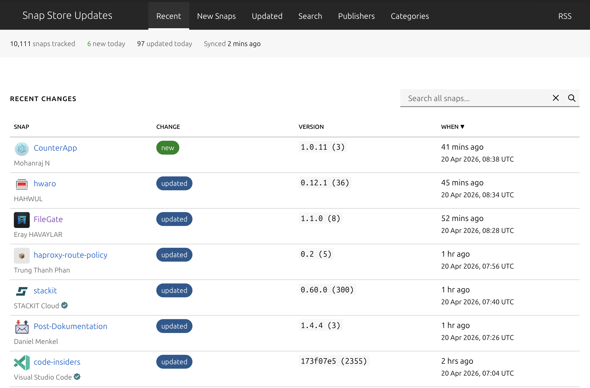

# Snap Store Updates

Track changes in the [Canonical Snap Store](https://snapcraft.io) — new snaps, updates, publishers, and categories — all in one place.

**Live at [snapupdates.popey.com](https://snapupdates.popey.com)**



> This is an unofficial community project and is not affiliated with or endorsed by Canonical.

## Features

- **Recent Changes** — sortable table of the latest new and updated snaps
- **Browse by Category** — 20 store sections with in-category search
- **Publisher Pages** — see all snaps from a given publisher
- **Snap Detail** — screenshots, version history with revision tracking, metadata, and external links
- **Search** — full-text search across all snaps
- **RSS Feeds** — per-snap, per-publisher, per-category, or firehose
- **No JavaScript** — fully server-rendered HTML (except nav toggle)
- **Mobile Friendly** — responsive layout using Canonical's [Vanilla Framework](https://vanillaframework.io)

## How It Works

A Cloudflare Worker syncs the full snap catalogue every 15 minutes via cron, storing snapshots in a D1 database. Changes are detected by comparing each sync against the previous state. A separate daily job syncs snap-to-category mappings.

The same Worker serves all HTML pages, RSS feeds, the sitemap, and the API.

## Tech Stack

| Component | Technology |
|-----------|------------|
| Runtime | [Cloudflare Workers](https://workers.cloudflare.com) |
| Database | [Cloudflare D1](https://developers.cloudflare.com/d1/) (SQLite) |
| Styling | [Vanilla Framework](https://vanillaframework.io) (SCSS) |
| Testing | [Vitest](https://vitest.dev) with [@cloudflare/vitest-pool-workers](https://developers.cloudflare.com/workers/testing/vitest-integration/) |

## Local Development

### Prerequisites

- Node.js 18+
- A Cloudflare account (free tier works for development)

### Setup

All worker commands run from the `snap-worker/` directory:

```bash
cd snap-worker
npm install
```

### Apply the database schema locally

```bash
cd snap-worker
npx wrangler d1 execute snap-catalogue --local --file=schema.sql
```

### Run the dev server

```bash
cd snap-worker
npm run dev
```

Visit [http://localhost:8787](http://localhost:8787). The local D1 database starts empty — trigger a sync or import data to populate it.

### Other commands

All commands assume you are in the `snap-worker/` directory.

| Command | Description |
|---------|-------------|
| `npm test` | Run tests |
| `npx tsc --noEmit` | Type-check |
| `npm run build:css` | Compile Vanilla Framework SCSS |
| `npm run deploy` | Build CSS and deploy to Cloudflare |

### Importing data

To copy production data for local development (from `snap-worker/`):

```bash
npx wrangler d1 export snap-catalogue --remote --output=snapshot.sql
npx wrangler d1 execute snap-catalogue --local --file=snapshot.sql
rm snapshot.sql
```

## Deployment

The Worker is deployed to Cloudflare via `npm run deploy`. You'll need:

- `CLOUDFLARE_ACCOUNT_ID` set as an environment variable
- `SYNC_SECRET` configured via `wrangler secret put SYNC_SECRET`

Cron triggers (every 15 min for catalogue sync, daily at 03:00 UTC for category sync) are configured in `wrangler.jsonc`.

## Pages

| Route | Description |
|-------|-------------|
| `/` | Homepage with recent changes |
| `/new` | New snaps (last 30 days) |
| `/updated` | Updated snaps (last 30 days) |
| `/categories` | Browse by category |
| `/categories/{section}` | Category detail (supports `?q=` filter) |
| `/publishers` | Top publishers |
| `/publisher/{name}` | Publisher detail |
| `/snap/{name}` | Snap detail with screenshots and version history |
| `/search?q=` | Full-text search |
| `/about` | About page |
| `/sitemap.xml` | Dynamic sitemap |

### RSS Feeds

| Feed | Route |
|------|-------|
| All changes | `/rss` |
| New snaps only | `/new/rss` |
| Updated snaps only | `/updated/rss` |
| Per snap | `/snap/{name}/rss` |
| Per publisher | `/publisher/{name}/rss` |
| Per category | `/categories/{section}/rss` |

## License

[MIT](LICENSE)
